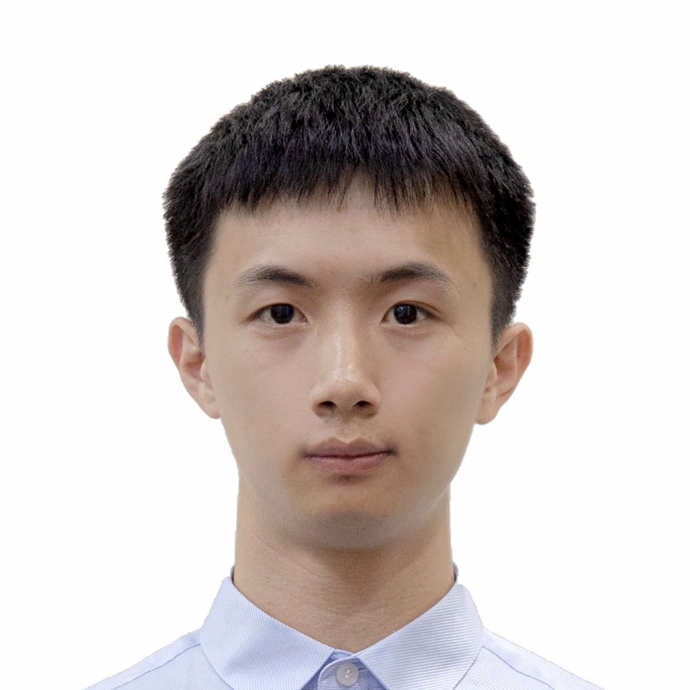
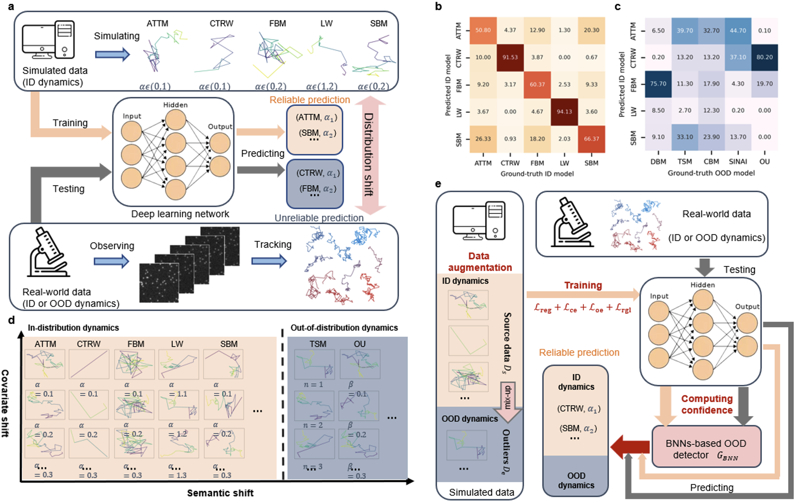
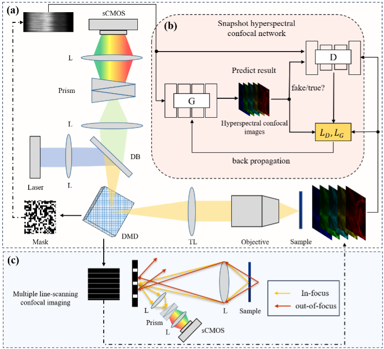
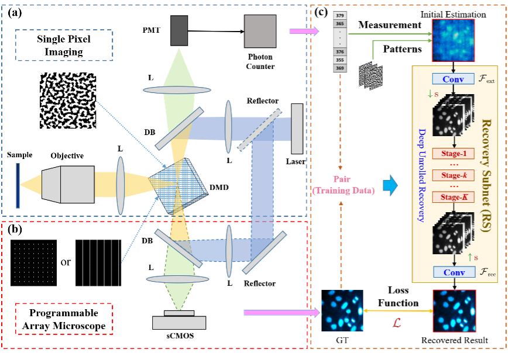
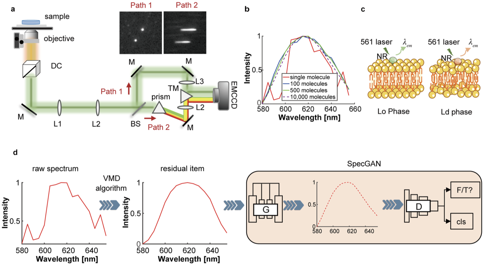
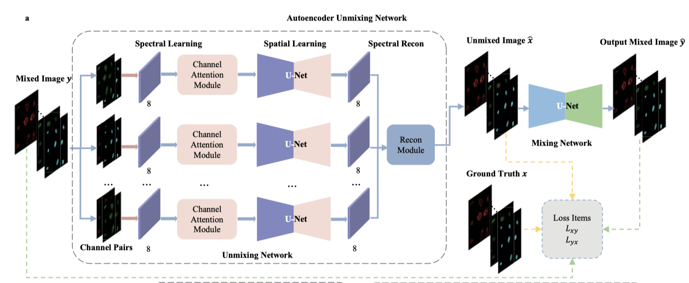
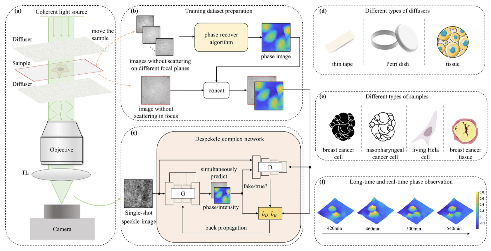
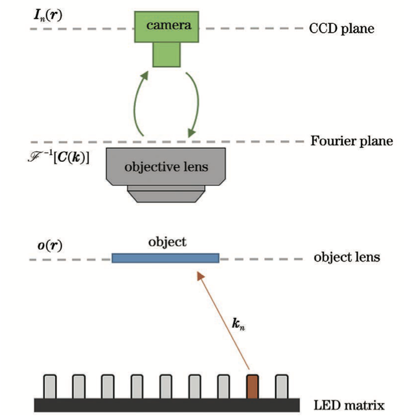

# Hao **Sha**

<!--
include contact information from the front matter
Supported arguments:
    - homepage: url, text
    - phone
    - email
-->



&nbsp;

&nbsp;

<table>
  <tr>
    <td style="width: 70%; vertical-align: middle;">
      I am currently a 3rd year PhD student in the department of <a href="http://cs.hitsz.edu.cn/">Computer Science</a>, <a href="http://en.hitsz.edu.cn/">Harbin Institute of Technology (ShenZhen)</a>. Previously, I received my MSE and BSE degrees from <a href="https://en.csu.edu.cn/">Central South University</a> and <a href="https://www.lit.edu.cn/">LuoYang Institute of Technology</a> in 2020 and 2017. My Ph.D. supdervisors are <a href="https://faculty.hitsz.edu.cn/zhangyongbing">Prof. Yongbing Zhang</a> from <a href="http://en.hitsz.edu.cn/">Harbin Institute of Technology (ShenZhen)</a> and <a href="http://houlab.szbl.ac.cn/"> Assistant Prof. Shangguo Hou</a> from <a href="https://www.szbl.ac.cn/en/"> Shenzhen Bay Laboratory</a>.  My research interests lie primarily in the areas of super-resolution imaging and single particle/molecule tracking. During my study in HIT and SZBL, I developed a single molecule spectrum tracking system. With this system, we can achieve tracking of single molecules spectrum at the spatiotemporal scale of millisecond-nanometers. Besides, I also spent a good time with <a href="https://www.sigs.tsinghua.edu.cn/hsy_en/main.htm">Assistant Prof. Sanyang Han</a>, <a href="http://web.ee.tsinghua.edu.cn/linxing/en/index.htm">Assistant Prof. Xing Lin</a>, and <a href="https://ee.jlu.edu.cn/en/info/1028/1106.htm"> Prof. Chenguang Wang</a>.</td>
    <td style="width: 30%; vertical-align: middle;">
      </td>
  </tr>
</table>

## Education

### **Shenzhen Bay Laboratory** `2022.01 -`

```
Shenzhen, China
```

- Visiting student in Institute of Systems and Physical Biology
- Single particle tracking, super resolution imaging, spetrum imaging
- Co-advised by [Assistant Prof. Shangguo Hou](https://www.szbl.ac.cn/en/scientificresearch/researchteam/2044.html) 


### **Harbin Institute of Technology (ShenZhen)** `2021.09 - `

```
Shenzhen, China
```

- GPA 3.6/4.0
- Ph.D. in Electronic Information, School of Computer Science and Technology
- Computing imaging, Artifitial intelligence
- advised by [Prof. Yongbing Zhang](https://scholar.google.com/citations?user=0KlvTEYAAAAJ&hl=en)

### **Central South University** `2017.9 - 2020.6`

```
Changsha, China
```

- GPA 3.6/4.0, Ranked 11 out of 168 students
- M.S. in Mechanical engineering, _Summa Cum Laude_
- Intelligent detection, Automation

### **LuoYang Institute of Technology** `2013.9 - 2017.6`

```
LuoYang, China
```

- GPA 3.5/4.0, Ranked No.1 totally
- B.S. in Automation, _Summa Cum Laude_
- Mechanical Enigeering Departmental Honors


## Experience
### **ZTE Cooperation** `2020.8 - 2021.8`

_Software development engineer - code design for video player_<br>

## Honors & Awards

[Shenzhen Bay Laboratory](https://www.szbl.ac.cn/) Distinguished Director Scholarship `SZBL, 2023` <br>
[Central South University](https://en.csu.edu.cn/) Highpower Technology Scholarship `CSU, 2019` <br>
[LuoYang Institute of Technology](https://www.lit.edu.cn/) Excellent Bachelor Thesis Award `LIT, 2017` <br>
National Encouragement Scholarship `LIT, 2016` <br>
First prize of [RoboCup Humanoid robot climbing Challenge](http://crc.drct-caa.org.cn/index.php/race?catid=2) `China Association of Automation, 2015` <br>
First prize of [Henan Province 12th Challenge Cup](https://www.tiaozhanbei.net/) `China Association for Science and Technology, 2015` <br>
National Encouragement Scholarship `LIT, 2015` <br>
First prize of [iCAN International Contest of innovAtioN](http://www.g-ican.com/home/index) `iCAN, 2014` <br>
First prize of [RoboCup Humanoid robot racing Challenge](http://crc.drct-caa.org.cn/index.php/race?catid=2) `China Association of Automation, 2014` <br>


## Publications


<div style="display: flex; flex-wrap: wrap; align-items: flex-start; gap: 20px; margin-bottom: 30px;">
  <div style="flex: 1;">
     
  </div >
  <div style="flex: 2; padding-left: 10px;">
    <h3><strong>Towards reliable deep learning in anomalous diffusion against out-of-distribution dynamics</strong></h3>
    <p>Xiaochen Feng*, <strong>Hao Sha*</strong>, Yuan Jiang, Sanyang Han, Yongbing Zhang</p>
    <p><em>xxx, 2024, in preparing</em></p>
    <p>
      <!-- 占位符，无内容 -->
    </p>
    <p>We present consensus framework for the evaluation of deep-learning based OOD dynamics detection and develop a baseline method that achieves robust OOD detection as well as accurate in-distribution (ID) recognition of anomalous diffusion. The method empowers deep-learning networks to examine OOD dynamics, which we validate using simulated and real data corresponding to biological and physical experiments.</p>
  </div>
</div>

<div style="display: flex; flex-wrap: wrap; align-items: flex-start; gap: 20px; margin-bottom: 30px;">
  <div style="flex: 1;">
    
  </div >
  <div style="flex: 2; padding-left: 10px;">
    <h3><strong>Deep learning-enhanced snapshot hyperspectral confocal microscopy imaging system</strong></h3>
    <p>Shuai Liu, Wenzhen Zou, <strong>Hao Sha</strong>, Xiaochen Feng, Bin Chen, Sanyang Han, Xiu Li, Yongbing Zhang</p>
    <p><em>Optics Express, 2024, Under Review</em></p>
    <p>
      <!-- 占位符，无内容 -->
      <a href="https://github.com/ClementZou/SHCNet">Github</a> /
    </p>
    <p>We propose a snapshot hyperspectral confocal microscopic imaging system (SHCMS). It combined coded illumination microscopy based on a digital micromirror device (DMD) with a snapshot hyperspectral confocal neural network (SHCNet) to realize single-shot confocal hyperspectral imaging. With SHCMS, high-contrast 160-band confocal hyperspectral images of potato tuber autofluorescence can be collected by only single-shot, which is almost 5 times improvement in the number of spectral channels than previously reported methods.</p>
  </div>
</div>

<div style="display: flex; flex-wrap: wrap; align-items: flex-start; gap: 20px; margin-bottom: 30px;">
  <div style="flex: 1;">
    
  </div >
  <div style="flex: 2; padding-left: 10px;">
    <h3><strong>Compressive confocal microscopy imaging at the single-photon level with ultra-low sampling ratios</strong></h3>
    <p>Shuai Liu, Bin Chen, Wenzhen Zou, <strong>Hao Sha</strong>, Xiaochen Feng, Xu Zhang,Xiu Li, Jian Zhang, Xuri Yao, Yongbing Zhang</p>
    <p><em>Communications Engineering, 2024, Under Review</em></p>
    <p>
      <!-- 占位符，无内容 -->
      <a href="https://github.com/Guaishou74851/DCCM">Github</a> /
    </p>
    <p>We build a novel deep compressive confocal microscope (DCCM). Combined with a deep learning reconstruction algorithm (DCCM-Net), our DCCM is able to achieve high-quality confocal microscopic imaging with low phototoxicity. Our imaging experiments with fluorescent microspheres demonstrate its capability of achieving single-pixel confocal imaging with a sampling ratio of only approximately 0.05%. In the prototype of our DCCM system, the imaging rates can achieve up to 833 fps and 13.65 megapixel/s.</p>
  </div>
</div>


<div style="display: flex; flex-wrap: wrap; align-items: flex-start; gap: 20px; margin-bottom: 30px;">
  <div style="flex: 1;">
    
  </div>
  <div style="flex: 2; padding-left: 10px;">
    <h3><strong><a href="./assets/APL-2023/096102_1_5.0156793.pdf">Deep learning-enhanced single-molecule spectrum imaging</a></strong></h3>
    <p><strong>Hao Sha</strong>, Haoyang Li, Yongbing Zhang, Shangguo Hou</p>
    <p><em>APL Photonics, 2023, Published</em></p>
    <p>
      <a href="./assets/APL-2023/096102_1_5.0156793.pdf">PDF</a> /
      <a href="https://www.biorxiv.org/content/10.1101/2023.05.08.539787v1.abstract">BioRxiV</a> /
      <a href="https://github.com/hitsh95/SpecGAN">Github</a> /
      <a href="./bibtex/photonics2023Sha.txt">BibTex</a> 
    </p>
    <p>A deep learning-enhanced single-molecule spectrum imaging method (SpecGAN) for improving the single-molecule spectrum imaging efficiency. With SpecGAN, the super-resolution spectrum image of the COS-7 membrane can be reconstructed with merely 12,000 frames of single-molecule localization images, which is almost half of the previously reported frame count for spectrally resolved super-resolution imaging.</p>
  </div>
</div>


<div style="display: flex; flex-wrap: wrap; align-items: flex-start; gap: 20px; margin-bottom: 30px;">
  <div style="flex: 1;">
    
  </div>
  <div style="flex: 2;">
    <h3><strong><a href="./assets/BOE-2023/boe-14-9-4814.pdf">AutoUnmix: an autoencoder-based spectral unmixing method for multi-color fluorescence microscopy imaging</a></strong></h3>
    <p>Yuan Jiang*, <strong>Hao Sha*</strong>, Shuai Liu, Peiwu Qin, Yongbing Zhang</p>
    <p><em>Biomedical Optics Express, 2023, Published</em></p>
    <p>
      <a href="./assets/BOE-2023/boe-14-9-4814.pdf">PDF</a> /
      <a href="https://www.biorxiv.org/content/10.1101/2023.05.30.542836v1">BioRxiV</a> /
      <a href="https://github.com/AlphaYuan/AutoUnmix">Github</a> / 
      <a href="./bibtex/BOE2023Jiang.txt">BibTex</a> 
    </p>
    <p>Propose a deep learning-based blindly spectral unmixing method, termed AutoUnmix, to imitate the physical spectral mixing process. Our proposed method has demonstrated real-time unmixing capabilities, surpassing existing methods by up to 100-fold in terms of unmixing speed.</p>
  </div>
</div>


<div style="display: flex; flex-wrap: wrap; align-items: flex-start; gap: 20px; margin-bottom: 20px;">
  <div style="flex: 1; ">
    
  </div>
  <div style="flex: 2;">
    <h3><strong><a href="./assets/despeckle-2022/1-s2.0-S0143816622002494-main.pdf">Intensity and phase imaging through scattering media via deep despeckle complex neural networks</a></strong></h3>
    <p>Shuai Liu*, Peng Li*,<strong>Hao Sha</strong>, Jiuyang Dong, Yue Huang, Xuri Yao, Qin Peng, Xiu Li, Xing Lin, Yongbing Zhang</p>
    <p><em>Optics and Lasers in Engineering, 2022, Published</em></p>
    <p>
      <a href="./assets/despeckle-2022/1-s2.0-S0143816622002494-main.pdf">PDF</a> /
      <a href="https://github.com/hitsh95/DespeckleNet">Github</a> /
      <a href="./bibtex/LIU2022107196.txt">BibTex</a> 
    </p>
    <p>A method to simultaneously predict both intensity and phase information from a speckle image employing a deep despeckle complex neural network (DespeckleNet). Various experiments demonstrate the superior reconstruction and generalization performance of our method under multiple types of biological samples with different scattering media. Our method offers simple yet effective imaging through scattering media and paves the way for real-time unlabeled biological imaging.</p>
  </div>
</div>


<div style="display: flex; align-items: center; justify-content: center; height: 250px;">
  <div style="flex: 1;">
    
  </div>
  <div style="flex: 2;">
    <h3><strong><a href="./assets/FPM-2021/1811020.pdf">Fourier Ptychography Based on Deep Learning</a></strong></h3>
    <p><strong>Hao Sha*</strong>, Yangzhe Liu, Yongbing Zhang</p>
    <p><em>Laser & Optoelectronics Progress, 2021, Published</em></p>
    <p>
      <a href="./assets/FPM-2021/1811020.pdf">PDF</a> /
      <a href="./bibtex/LOP2021Sha.txt">BibTex</a> 
    </p>
    <p>An algorithm combining computational imaging prior knowledge and deep learning is proposed to deal the FPM reconstruction process.</p>
  </div>
</div>


---

